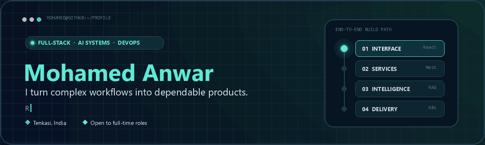
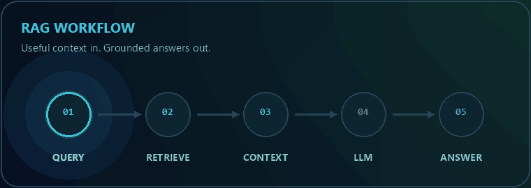

<div align="center">
  <picture>
    <source media="(prefers-reduced-motion: reduce)" srcset="./assets/profile-hero.svg" />
    
  </picture>
</div>

<p align="center">
  <a href="https://mohamed-anwar-portfolio-v3-1lwr.onrender.com"></a>
  <a href="https://www.linkedin.com/in/MohamedAnwar070"></a>
  <a href="mailto:mohamedanwar.asraf@gmail.com"></a>
</p>

<p align="center">
  
  
  
</p>

## 01 / The short version

I'm a **Full Stack Developer at Arffy Technologies** who turns complex workflows into production-ready software—from responsive interfaces and REST APIs to database architecture, AI retrieval, and cloud-native delivery.

My sweet spot is the space where **product engineering meets applied AI**: RAG pipelines, LLM integrations, vector search, intelligent document workflows, and the dependable systems around them.

<div align="center">
  <picture>
    <source media="(prefers-reduced-motion: reduce)" srcset="./assets/rag-workflow-static.png" />
    
  </picture>
  <br />
  <sub>Query → Retrieve → Context → LLM → Answer — applied AI wired into real products.</sub>
</div>

<br />

<table>
  <tr>
    <td align="center" width="33%"><strong>6+</strong><br />production applications delivered</td>
    <td align="center" width="33%"><strong>6 domains</strong><br />hiring · education · healthcare · AI · IoT · documents</td>
    <td align="center" width="33%"><strong>End to end</strong><br />UI · APIs · data · AI · deployment</td>
  </tr>
</table>

## 02 / Systems I've helped bring to life

> Most systems below were delivered through professional work and are not linked as public source repositories. Public learning projects are linked in the next section.

| Domain | System | What I delivered |
|---|---|---|
| AI orchestration | **LLM workflow engine** | Flowise-based RAG pipelines and MCP-connected tools for chatbot-driven business workflows |
| Hiring | **Multi-role job platform** | Job seeker, employer, and admin experiences with role-based access using React and NestJS |
| Education | **Student portal** | Learner/admin dashboards, payment integration, and a promo-code workflow |
| Healthcare | **Claims management platform** | Structured case workflows, data management, and AI-assisted back-office processing |
| Document intelligence | **OCR + semantic search** | Python FastAPI services, vector embeddings, and intelligent document retrieval |
| IoT | **Smart door-lock platform** | Centralized access control and permission management for a beta product |

## 03 / Public builds

| Repository | What it demonstrates | Stack |
|---|---|---|
| [CSS Showcase](https://github.com/MohamedAnwar070/CSS-Showcase) | An educational playground for container queries, scroll timelines, `:has()`, `color-mix()`, glassmorphism, and other modern CSS capabilities | HTML · CSS · JavaScript |
| [Native Specials](https://github.com/MohamedAnwar070/Native_Specials_Project) | A public feature slice from a larger e-commerce build covering catalog, cart, checkout, authentication, and admin concepts | Django · JavaScript · SQLite |
| [WAR_BANK](https://github.com/MohamedAnwar070/war_bank) | A Django banking application with account creation, PIN-based access, and balance tracking | Python · Django · HTML |
| [Python Projects](https://github.com/MohamedAnwar070/PythonProjects) | Small systems for banking, coffee-machine simulation, and student records—built to practise Python and OOP fundamentals | Python |

## 04 / My engineering toolbox

<p align="center">
  
</p>

- **Frontend:** React.js, AngularJS, JavaScript ES6+, TypeScript, HTML5, CSS3, Tailwind CSS
- **Backend & APIs:** Node.js, NestJS, FastAPI, Django, Python, Java, Spring Boot, REST API design
- **Data:** PostgreSQL, MySQL, MongoDB, SQLite, vector embeddings and semantic search
- **Applied AI:** Flowise AI, RAG, LLM integration, AI chatbots and MCP tool integration
- **Delivery:** Docker, Kubernetes YAML, Git/GitHub, Linux, Postman and VS Code
- **Architecture:** Clean architecture, microservices, scalable design and performance optimization

## 05 / Experience

**Full Stack Developer · Arffy Technologies** `Jun 2025 — Present`

- Independently own frontend, backend, database design, REST integration, containerization, and Kubernetes deployment across production systems.
- Build AI-enabled workflows with Flowise, LLMs, RAG, vector search, and MCP-connected tools.
- Apply clean architecture and maintainability standards while optimizing real-world product performance.

**Web Development Trainee & Intern · Aruvi Infotech** `Jul 2024 — May 2025`

- Built full-stack Django and JavaScript applications for real business scenarios.
- Strengthened cross-functional delivery through e-commerce, banking, and student-management projects.

## 06 / Education

- **B.E. in Computer Science**, Al-Ameen Engineering College · 2020–2024 · CGPA **7.5/10**
- **Full Stack Development Training & Internship**, Aruvi Institute of Learning · 2024–2025

## 07 / GitHub at a glance

<p align="center">
  
  
</p>

<p align="center">
  
</p>

## 08 / What I bring to a team

```yaml
ownership:     "I can take a feature from conversation to production."
architecture:  "I favour clean boundaries and systems that remain easy to change."
collaboration: "I communicate clearly, learn quickly, and keep delivery moving."
focus:         "Useful AI, dependable products, and measurable user value."
```

<div align="center">

### Have a product, platform, or AI workflow to build?

I'm open to full-time opportunities and conversations about meaningful software.

[**Portfolio**](https://mohamed-anwar-portfolio-v3-1lwr.onrender.com) · [**LinkedIn**](https://www.linkedin.com/in/MohamedAnwar070) · [**Email**](mailto:mohamedanwar.asraf@gmail.com)

<sub>Building useful systems, one clean boundary at a time.</sub>

</div>
