<div align="center">
  
</div>

<p align="center">
  <a href="https://mohamed-anwar-portfolio-v3-1lwr.onrender.com"></a>
  <a href="https://www.linkedin.com/in/MohamedAnwar070"></a>
  <a href="mailto:mohamedanwar.asraf@gmail.com"></a>
</p>

<p align="center">
  
  
  
</p>

## `SYS.00` · Boot sequence — the short version

I'm a **Full Stack Developer at Arffy Technologies** who turns complex workflows into production-ready software—from responsive interfaces and REST APIs to database architecture, AI retrieval, and cloud-native delivery.

My sweet spot is the space where **product engineering meets applied AI**: RAG pipelines, LLM integrations, vector search, intelligent document workflows, and the dependable systems around them.

<div align="center">
  
</div>

## `SYS.01` · Request trace — applied AI in production

<div align="center">
  
  <br />
  <sub>Query → Retrieve → Context → LLM → Answer — applied AI wired into real products.</sub>
</div>

## `SYS.02` · Service registry — systems I've helped bring to life

> Most systems below were delivered through professional work and are not linked as public source repositories. Public learning projects are linked in the next section.

| SERVICE | DOMAIN | DEPLOYED CAPABILITY |
|---|---|---|
| **LLM workflow engine** `svc://rag-core` | AI orchestration | Flowise-based RAG pipelines and MCP-connected tools for chatbot-driven business workflows |
| **Multi-role job platform** `svc://hire` | Hiring | Job seeker, employer, and admin experiences with role-based access using React and NestJS |
| **Student portal** `svc://edu` | Education | Learner/admin dashboards, payment integration, and a promo-code workflow |
| **Claims management platform** `svc://claims` | Healthcare | Structured case workflows, data management, and AI-assisted back-office processing |
| **OCR + semantic search** `svc://docs` | Document intelligence | Python FastAPI services, vector embeddings, and intelligent document retrieval |
| **Smart door-lock platform** `svc://iot-lock` | IoT | Centralized access control and permission management for a beta product |

## `SYS.03` · Public endpoints — open-source builds

| ENDPOINT | DEMONSTRATES | STACK |
|---|---|---|
| [CSS Showcase](https://github.com/MohamedAnwar070/CSS-Showcase) | An educational playground for container queries, scroll timelines, `:has()`, `color-mix()`, glassmorphism, and other modern CSS capabilities | HTML · CSS · JavaScript |
| [Native Specials](https://github.com/MohamedAnwar070/Native_Specials_Project) | A public feature slice from a larger e-commerce build covering catalog, cart, checkout, authentication, and admin concepts | Django · JavaScript · SQLite |
| [WAR_BANK](https://github.com/MohamedAnwar070/war_bank) | A Django banking application with account creation, PIN-based access, and balance tracking | Python · Django · HTML |
| [Python Projects](https://github.com/MohamedAnwar070/PythonProjects) | Small systems for banking, coffee-machine simulation, and student records—built to practise Python and OOP fundamentals | Python |

## `SYS.04` · Runtime stack — my engineering toolbox

<div align="center">
  
</div>

<details>
<summary><b>Expand full manifest</b> — every tool, grouped</summary>
<br />

- **Frontend:** React.js, AngularJS, JavaScript ES6+, TypeScript, HTML5, CSS3, Tailwind CSS
- **Backend & APIs:** Node.js, NestJS, FastAPI, Django, Python, Java, Spring Boot, REST API design
- **Data:** PostgreSQL, MySQL, MongoDB, SQLite, vector embeddings and semantic search
- **Applied AI:** Flowise AI, RAG, LLM integration, AI chatbots and MCP tool integration
- **Delivery:** Docker, Kubernetes YAML, Git/GitHub, Linux, Postman and VS Code
- **Architecture:** Clean architecture, microservices, scalable design and performance optimization

<p align="center">
  
</p>

</details>

## `SYS.05` · Deployment history — experience & education

<div align="center">
  
</div>

**Full Stack Developer · Arffy Technologies** `Jun 2025 — Present`

- Independently own frontend, backend, database design, REST integration, containerization, and Kubernetes deployment across production systems.
- Build AI-enabled workflows with Flowise, LLMs, RAG, vector search, and MCP-connected tools.
- Apply clean architecture and maintainability standards while optimizing real-world product performance.

**Web Development Trainee & Intern · Aruvi Infotech** `Jul 2024 — May 2025`

- Built full-stack Django and JavaScript applications for real business scenarios.
- Strengthened cross-functional delivery through e-commerce, banking, and student-management projects.

**Education**

- **B.E. in Computer Science**, Al-Ameen Engineering College &nbsp;<sub>2020–2024 · CGPA **7.5/10**</sub>
- **Full Stack Development Training & Internship**, Aruvi Institute of Learning &nbsp;<sub>2024–2025</sub>

## `SYS.06` · Telemetry — GitHub at a glance

<p align="center">
  
  
</p>

<p align="center">
  
</p>

## `SYS.07` · Operator notes — what I bring to a team

```yaml
ownership:     "I can take a feature from conversation to production."
architecture:  "I favour clean boundaries and systems that remain easy to change."
collaboration: "I communicate clearly, learn quickly, and keep delivery moving."
focus:         "Useful AI, dependable products, and measurable user value."
```

<div align="center">

  

[**Portfolio**](https://mohamed-anwar-portfolio-v3-1lwr.onrender.com) · [**LinkedIn**](https://www.linkedin.com/in/MohamedAnwar070) · [**Email**](mailto:mohamedanwar.asraf@gmail.com)

<sub>ANWR-01 // console session ends — thanks for reading.</sub>

</div>
